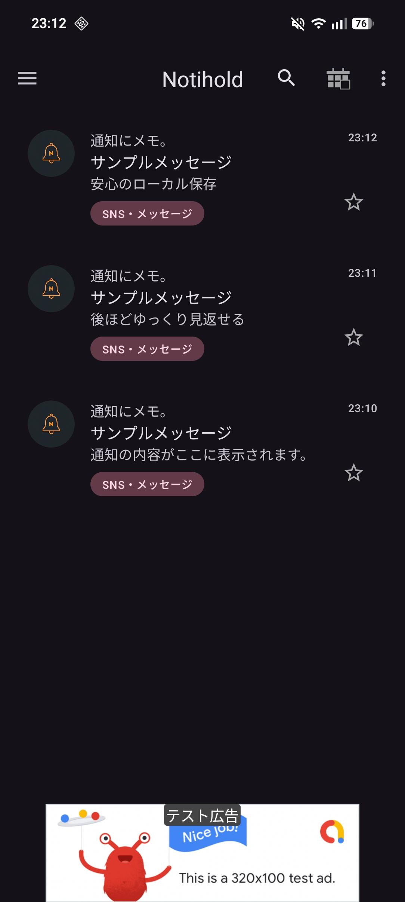
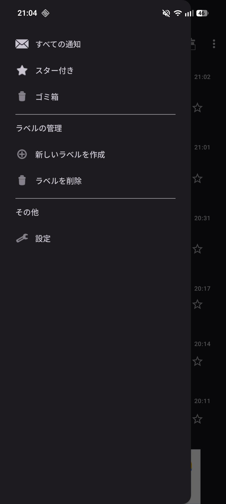

# NotiHold - 通知保存・ログ管理アプリ

「NotiHold（ノーティホールド）」は、スマホに届くあらゆる通知を自動で記録し、データのポータビリティを確保するために開発された Android アプリケーションです。

## 📋 開発の背景と目的
「あ、今の通知、間違えて消しちゃった。。」
「忙しくてすぐ見られないけど、後でまとめてチェックしたい」

そんな日常の課題を解決するために開発しました。アプリ名の由来は、通知を「後ほど」確認することです。「通知に振り回されるのではなく、自分のペースで確認してほしい」という想いを込めています。

本アプリは、以下のニーズを満たすために開発しました：
- **通知のバックアップ**: 誤操作で消去した通知や、送信者が取り消したメッセージのログを保持する。
- **情報の集約（セントラライズ）**: 複数のSNSやアプリから届く通知を、単一のタイムラインで一括管理する。
- **プライバシーの徹底**: 読み取った通知データを外部サーバーへ一切送信せず、端末内（ローカル）でのみ完結させる。

## ✨ 主な機能
- **通知の自動保存**: 届いた通知をリアルタイムでデータベースに記録。
- **通知の復元・閲覧**: 消去されたメッセージや通知履歴を後から確認。
- **高度な検索・管理**: アプリごとの抽出やキーワード検索により、必要な情報を素早く発見。
- **モダンなUI/UX**: Material Design 3 に基づいた洗練されたデザイン。

## 🛠 Tech Stack
- Language: Kotlin
- UI Framework: Jetpack Compose
- Design System: Material Design 3 (Dynamic Color対応)
- Architecture: MVVM
- Database: Room (通知ログの永続化)

## 🚀 技術的なこだわり
### 1。 プライバシーとセキュリティ
通知という機密性の高い情報を扱うため、インターネット通信権限を最小限に抑えています。データはすべて Android の `Room` データベースを用い、暗号化された領域（端末内）でのみ管理される設計にしました。

### 2。 軽量かつ堅牢なバックグラウンド処理
通知のリスニングは Android の `NotificationListenerService` を活用しています。バッテリー消費を最小限に抑えつつ、システムによってプロセスが終了されにくい安定した常駐処理を実現しました。

### 3。 Material Design 3 と Dynamic Color
最新の Android デザインシステムである Material Design 3 を採用しています。Dynamic Color に対応しており、ユーザーの端末設定に合わせたパーソナライズされた視覚体験を提供します。

### 4。 スケーラブルな開発環境
Gradle によるビルド自動化を行い、GitHub Releases を通じたデプロイフローを構築しています。

## 📸 スクリーンショット
| 通知一覧画面 | 詳細・設定画面 |
| :--- | :--- |
|  |  |

## 📦 インストール方法
[Releases](https://github.com/kwn0827/NotiHold/releases) ページから最新の `app-release.apk` をダウンロードし、Android 端末にインストールしてください。
※本アプリは通知へのアクセス権限を必要とします。インストール後、設定画面から許可を行ってください。

---
Author: Keigo Kawano (M1、 Aichi Prefectural University)
